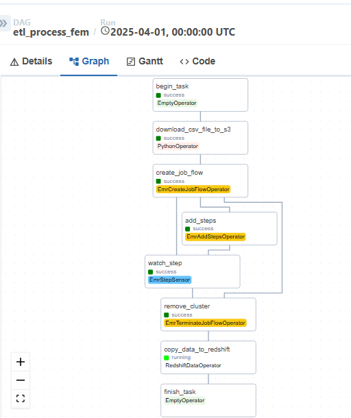

# Violence Cases Data Pipeline - Peru

## Running DAGS on Airflow
This project processes violence cases data in Peru using Airflow in a Docker container.

### Requirements
In order to run Airflow and the pipeline in this project, you need to have:

* [Docker](https://www.docker.com) and [docker compose](https://docs.docker.com/compose/install) installed. This can be checked by running 
```bash
docker -v
``` 

* [AWS Account](https://aws.amazon.com/account/) with access to:
  - [S3 bucket](https://aws.amazon.com/s3/)
  - EMR service
  - Redshift cluster
* AWS credentials (**AWS_ACCESS_KEY_ID** and **AWS_SECRET_ACCESS_KEY**)

### Set ENVIRONMENT VARIABLES
Before building the airflow docker image, it is necessary to set ENVIRONMENT VARIABLES in a `.env` file.

To do so, rename the `.env.example` file located in this directory to `.env` then add the correct values for your own environment:

```bash
# Custom
AIRFLOW_CONN_AWS_DEFAULT="aws://<your-access-key>:<your-secret-key>@"
AWS_DEFAULT_REGION="us-east-1"
AWS_PROFILE=default
S3_BUCKET=your-bucket-name
USER_NUMBER=your-user-number

# Redshift Connection
AIRFLOW_CONN_REDSHIFT_DEFAULT='redshift+psycopg2://<user>:<password>@<your-cluster>.<region>.redshift.amazonaws.com:5439/dev'
```

The `AIRFLOW_UID` value can be obtained from the following command:
```bash
echo -e "AIRFLOW_UID=$(id -u)" > .env
```
Then `AIRFLOW_GID` can be set to `0`.

### Project Structure
airflow/
├── dags/
│ ├── scripts/
│ │ └── transformation.py # Spark transformation logic
│ └── proc_0_ingestion_to_s3_dag.py # Main ETL pipeline
├── Dockerfile
├── docker-compose.yaml
├── requirements.txt
└── .env.example

The transformation.py must be uploaded on S3. The general bucket structure used is the following:


- Emr requires a folder for its loggings 


### Dockerfile and docker-compose.yaml
The Dockerfile includes essential packages:
1. AWS CLI for AWS service interaction
2. Required Python packages:
   - apache-airflow-providers-amazon
   - pandas
   - bs4

The `docker-compose.yaml` is configured for local Airflow deployment.

### Run Airflow

1. Build docker image with the current Dockerfile
```bash
docker build -t airflow-img .
```
This command should be run only once or after editing the content of Dockerfile.

2. Initialize Airflow
```bash
docker-compose up airflow-init
```
This command should terminate with `exit code 0` if everything went well.

3. Launch Airflow
```bash
docker-compose up -d
```

4. Visit [http://localhost:8080](http://localhost:8080) to access the Airflow GUI.

5. In order to stop the Airflow container,
```bash
docker-compose down
```

### Pipeline Flow



1. Data Ingestion (`etl_dag.py`):
   - Downloads violence cases data for specified year in CSV
   - Stores raw data in S3 bucket
   - Triggers EMR cluster for transformation

2. Data Transformation (`transformation.py`):
   - Cleans and standardizes data
   - Processes violence cases information
   - Outputs Parquet files to S3

3. Data Loading:
   - Loads transformed data to Redshift
   - Creates final analytics tables

### Note: 
- The pipeline processes data year by year
- EMR clusters are automatically terminated after use
- Make sure to configure AWS services properly:
  * S3 bucket permissions
  * EMR roles and permissions
  * Redshift cluster access
